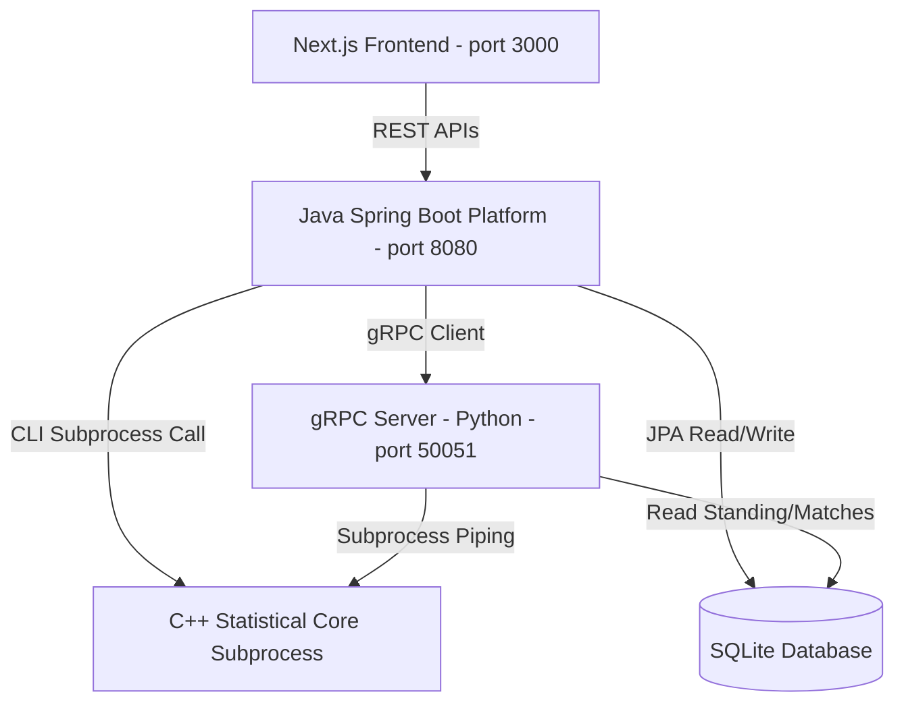

# OddsEngine — System Architecture

The monorepo maps components across boundaries from high-performance C++ modeling up to Next.js interactive web client rendering.

## High-Level Diagram

## System Components

1. **C++ Statistical Core (`engine/src/`)**
   - Core CLI executable (`engine.exe`) providing generalized Elo, Glicko-2, Poisson scorelines, Plackett-Luce F1 fits, Bayesian updates, and Monte Carlo simulator.
   - Designed for low-latency calculations via gradient descent and sequential loops.

2. **gRPC Server (`engine/engine_service.py`)**
   - Lightweight Python wrapper container exposing statistical prediction, rating calculation, and simulation streaming routes over Protobuf contracts.

3. **Java Platform (`platform/src/`)**
   - High-throughput REST API server driven by Spring Boot.
   - Drives databases transaction updates, migrations (Flyway), rating snapshot logs, and match ingestion adapters.

4. **Frontend Dashboard (`frontend/src/`)**
   - High-fidelity Next.js web dashboard styled with dark-mode Vanilla CSS.
   - Visualizes leadership matrices, calibration diagram curves, and Monte Carlo standing outputs.
